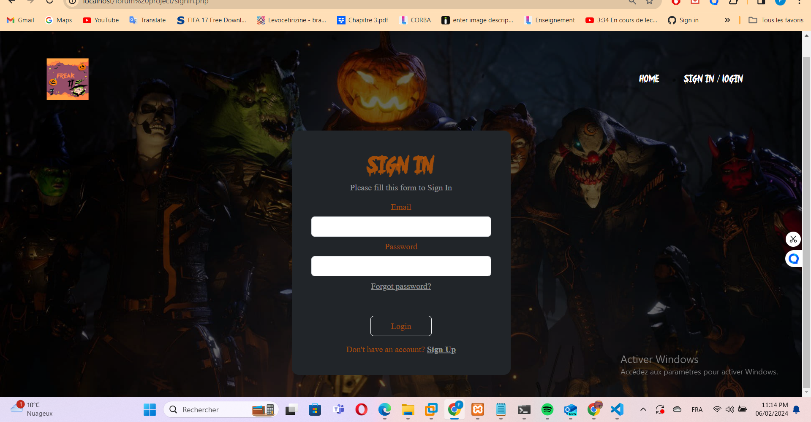
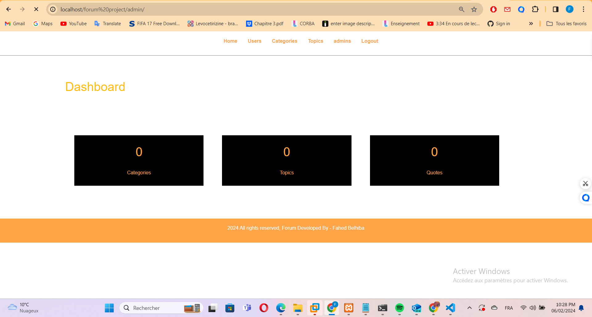

## Cosplay & Halloween Forum project 

## Introduction:

Welcome aboard to our lively and inclusive online forum, where cosplay enthusiasts and Halloween aficionados come together to celebrate their passion for creativity, imagination, and all things fantastical!

## Purpose:

This document serves as an overview and explanation of our forum project, detailing its key features and the inclusive environment we strive to foster.

## Let's Dive In:

In this doc we will discuss 

1. **Logo and Graphical chart:**  ** Our forum's logo and graphical chart are integral components of our visual identity, representing the essence of our community and guiding the design of our platform

2. **User & Interfaces :** We'll explore how our UI prioritizes user experience (UX), design aesthetics, and responsive design to create an engaging and accessible environment for community members.

3. **Admin & Interfaces :** we'll discuss the admin interfaces, focusing on the dashboard, moderation tools, and security features that empower administrators to effectively manage and moderate the forum

5. **Hosting**  Lastly, we'll touch upon our hosting infrastructure we will use RockyLinux9 and Mysql

## LOGO AND GRAPHICAL CHART

 ## LOGO 

I wanted our forum to have a unique and personal touch, so I took the initiative to create a logo and some captivating cosplay images using Photoshop.

[FreakIt_logo](freakit.PNG)

## Graphical Chart 

For the Graphical chart i used  2 fonts Halloween and Cosplay , for the color palette i used #c85a00bf and #000000 

## User & Interfaces 

### 1-Home page
For the user interface, I designed a welcoming home page that serves as the gateway to our vibrant community. On this page, users are greeted with an inviting layout that encourages exploration and engagement.

### 2-Sign up page
For the sign up page user have to fill form with:
`'Pseudo'` : unique nickname for the account  VARCHAR
`'email'` : unique for every user       VARCHAR
`'password'` : Password will be hashed  VARCHAR
`'Birthdate'` : User birthday DD-MM-YY DATE
`'roles'` :  2 Types admin and user  JSON

once the user sign up a verfication email will send  to its email and once he clicked the account `activated` 

### 2-Sign in page 

Upon selecting a topic to discuss, users are prompted to sign in to their account to participate in the conversation. The sign-in page features a clean and intuitive interface, allowing users to easily input their credentials and access their account

### 3-topics discussion (Quotes)

for commenting user can click quote in a topic after log in and he can send he's quote he can also add a link or image to the message of the quote using [link= src] , [image= src]

## admin & Interfaces 

For the admin interface, Administrators have special tools to manage the forum. They can see a summary of forum activity on the dashboard, manage topics, manage user accounts, and admin accounts settings.

### 1-Dashboard 
for the Dashboard admin can see the number of Users , Topics and quotes

 

### 2-Manage users 
admin can delete users in this page 

 

### 3-Manage admin 

admin can delete admin in this page 

 

### 4-Manage Topics 

admin can delete or close topic in this page 

## Hosting
### Hosting with Rocky Linux and MySQL

I've chosen to host our forum platform on Rocky Linux for its stability and security. By utilizing MySQL as our database management system, I ensure efficient data storage and management. This setup guarantees reliability, security, and optimal performance for our forum.

i use `VMware workstation` for installin rockylinux 

